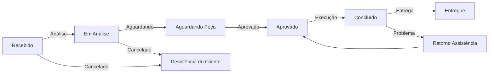

# 🛣️ Mapa de Rotas da API - TechFlow ERP

## Estrutura de Endpoints REST

### 1️⃣ AUTENTICAÇÃO
```
POST   /api/auth/login                 Fazer login
POST   /api/auth/logout                Fazer logout
POST   /api/auth/refresh-token         Renovar token
GET    /api/auth/me                    Dados do usuário atual
```

### 2️⃣ USUÁRIOS (RBAC: admin, gerente)
```
GET    /api/users                      Listar todos os usuários
GET    /api/users/:id                  Obter usuário específico
POST   /api/users                      Criar novo usuário
PUT    /api/users/:id                  Atualizar usuário
DELETE /api/users/:id                  Deletar usuário
GET    /api/users/:id/os               Ordens de serviço do técnico
```

### 3️⃣ CLIENTES (RBAC: admin, gerente, administrativo, atendente)
```
GET    /api/customers                  Listar clientes
GET    /api/customers/:id              Obter cliente específico
POST   /api/customers                  Criar novo cliente
PUT    /api/customers/:id              Atualizar cliente
DELETE /api/customers/:id              Deletar cliente
GET    /api/customers/:id/orders       Ordens de serviço do cliente
GET    /api/customers/:id/payments     Pagamentos do cliente
```

### 4️⃣ ORDENS DE SERVIÇO (RBAC: todos)
```
GET    /api/service-orders             Listar ordens (com filtros)
GET    /api/service-orders/:id         Obter detalhes da OS
POST   /api/service-orders             Criar nova OS
PUT    /api/service-orders/:id         Atualizar OS
PATCH  /api/service-orders/:id/status  Alterar status da OS
DELETE /api/service-orders/:id         Cancelar OS
```

**Filtros suportados:**
- `?status=Recebido` - Por status
- `?cliente_id=xxx` - Por cliente
- `?tecnico_id=xxx` - Por técnico responsável
- `?data_inicio=2024-01-01&data_fim=2024-12-31` - Por período
- `?page=1&limit=20` - Paginação

#### Sub-recursos da OS:
```
GET    /api/service-orders/:id/items           Peças/Kits da OS
POST   /api/service-orders/:id/items           Adicionar peça/kit
DELETE /api/service-orders/:id/items/:itemId   Remover peça/kit

GET    /api/service-orders/:id/services        Serviços da OS
POST   /api/service-orders/:id/services        Adicionar serviço
DELETE /api/service-orders/:id/services/:srvId Remover serviço

GET    /api/service-orders/:id/checklist       Obter checklist
PUT    /api/service-orders/:id/checklist       Atualizar checklist

GET    /api/service-orders/:id/medias          Fotos/Mídia
POST   /api/service-orders/:id/medias          Upload de fotos
DELETE /api/service-orders/:id/medias/:mediaId Deletar foto

GET    /api/service-orders/:id/history         Histórico de status
GET    /api/service-orders/:id/payments        Pagamentos
```

### 5️⃣ PEÇAS DO ESTOQUE (RBAC: admin, gerente, administrativo)
```
GET    /api/product-parts               Listar peças
GET    /api/product-parts/:id           Obter peça específica
POST   /api/product-parts               Criar peça
PUT    /api/product-parts/:id           Atualizar peça
DELETE /api/product-parts/:id           Deletar peça
GET    /api/product-parts/sku/:codigo   Buscar por SKU
```

**Filtros:**
- `?categoria=Tela` - Por categoria
- `?equipamento_tipo=Notebook` - Por tipo de equipamento
- `?estoque_minimo=true` - Peças abaixo do mínimo
- `?ativo=true` - Apenas ativas

### 6️⃣ KITS (RBAC: admin, gerente, administrativo)
```
GET    /api/kits                        Listar kits
GET    /api/kits/:id                    Obter kit específico
POST   /api/kits                        Criar novo kit
PUT    /api/kits/:id                    Atualizar kit
DELETE /api/kits/:id                    Deletar kit
```

#### Sub-recursos do Kit:
```
GET    /api/kits/:id/items              Peças do kit
POST   /api/kits/:id/items              Adicionar peça ao kit
DELETE /api/kits/:id/items/:itemId      Remover peça do kit
```

### 7️⃣ SERVIÇOS (RBAC: admin, gerente)
```
GET    /api/services                    Listar serviços
GET    /api/services/:id                Obter serviço específico
POST   /api/services                    Criar novo serviço
PUT    /api/services/:id                Atualizar serviço
DELETE /api/services/:id                Deletar serviço
```

**Filtros:**
- `?categoria=Reparo` - Por categoria
- `?ativo=true` - Apenas ativos

### 8️⃣ PAGAMENTOS (RBAC: admin, gerente, administrativo)
```
GET    /api/payments                    Listar pagamentos
GET    /api/payments/:id                Obter pagamento específico
POST   /api/payments                    Registrar pagamento
PUT    /api/payments/:id                Atualizar pagamento
DELETE /api/payments/:id                Deletar pagamento
GET    /api/payments/os/:osId           Pagamentos de uma OS
```

**Filtros:**
- `?forma_pagamento=Pix` - Por forma de pagamento
- `?data_inicio=2024-01-01` - Por período
- `?os_id=xxx` - Por ordem de serviço

### 9️⃣ INVENTÁRIO FÍSICO (RBAC: admin, gerente, administrativo)
```
GET    /api/physical-inventories        Listar inventários
GET    /api/physical-inventories/:id    Obter inventário específico
POST   /api/physical-inventories        Criar novo inventário
PUT    /api/physical-inventories/:id    Atualizar inventário
PATCH  /api/physical-inventories/:id/finalize  Finalizar inventário
```

#### Sub-recursos do Inventário:
```
GET    /api/physical-inventories/:id/items        Itens do inventário
POST   /api/physical-inventories/:id/items        Adicionar item
PUT    /api/physical-inventories/:id/items/:itemId Atualizar item
DELETE /api/physical-inventories/:id/items/:itemId Remover item
```

### 🔟 DASHBOARD (RBAC: admin, gerente)
```
GET    /api/dashboard/metrics           Métricas principais
GET    /api/dashboard/alerts            Alertas de estoque/prazos
GET    /api/dashboard/load              Carga por técnico
GET    /api/dashboard/monthly-summary   Resumo mensal
```

**Retorno esperado:**
```json
{
  "osAbertas": 15,
  "osEmAndamento": 8,
  "osAtrasadas": 3,
  "estoqueMinimo": 5,
  "clientesInadimplentes": 2,
  "receitaMes": 25000.00,
  "custoMes": 12000.00,
  "lucroMes": 13000.00,
  "cargaTecnico": [
    {"tecnico": "João Silva", "osPendentes": 3, "osEmAndamento": 5}
  ]
}
```

---

## 📊 Estrutura de Resposta Padrão

### Sucesso (200, 201)
```json
{
  "success": true,
  "data": {...},
  "message": "Operação realizada com sucesso"
}
```

### Lista com Paginação
```json
{
  "success": true,
  "data": [...],
  "pagination": {
    "page": 1,
    "limit": 20,
    "total": 150,
    "pages": 8
  }
}
```

### Erro (400, 401, 403, 404, 500)
```json
{
  "success": false,
  "error": {
    "code": "VALIDATION_ERROR",
    "message": "Email já cadastrado",
    "details": [
      {
        "field": "email",
        "message": "Email deve ser único"
      }
    ]
  }
}
```

---

## 🔐 Headers Obrigatórios

```
Authorization: Bearer <JWT_TOKEN>
Content-Type: application/json
```

---

## 📋 Códigos de Erro HTTP

| Código | Significado |
|--------|-------------|
| 200 | OK - Requisição bem-sucedida |
| 201 | Created - Recurso criado |
| 204 | No Content - Sem conteúdo na resposta |
| 400 | Bad Request - Dados inválidos |
| 401 | Unauthorized - Não autenticado |
| 403 | Forbidden - Sem permissão (RBAC) |
| 404 | Not Found - Recurso não encontrado |
| 409 | Conflict - Violação de constraint |
| 500 | Internal Server Error - Erro do servidor |

---

## 🔄 Ciclo de Vida de uma Ordem de Serviço



---

## 🎯 Validações Obrigatórias por Endpoint

### POST /api/service-orders (Criar OS)
- `cliente_id` - Deve existir em customers
- `atendente_id` - Deve existir em users e ser 'atendente' ou superior
- `equipamento_tipo` - Deve ser um dos enums definidos
- `protocolo_os` - Gerado automaticamente, não aceita entrada

### PUT /api/service-orders/:id/status (Alterar Status)
- Status anterior deve permitir transição para novo status
- Se novo status = 'Concluído': deve ter pelo menos um serviço ou item
- Se novo status = 'Entregue': deve estar concluído

### POST /api/product-parts (Criar Peça)
- `codigo_sku` - Deve ser único
- `quantidade_minima` - Deve ser >= 0
- `preco_custo` - Deve ser > 0
- `preco_venda` - Deve ser >= preco_custo

### POST /api/payments (Registrar Pagamento)
- `os_id` - Deve existir
- `valor` - Deve ser <= valor_total da OS
- `forma_pagamento` - Deve ser um dos enums

---

## 📈 Escalabilidade e Performance

### Índices Criados (para otimizar queries)
- `users.email` - Busca por email
- `customers.documento`, `customers.email`, `customers.status` - Filtros
- `service_orders.protocolo_os`, `status`, `cliente_id`, `data_abertura` - Principais
- `product_parts.codigo_sku`, `categoria`, `equipamento_tipo` - Catálogo
- `payments.data_pagamento`, `forma_pagamento` - Histórico
- `physical_inventories.data_inventario`, `status` - Rastreabilidade

### Paginação Padrão
- **Limit:** 20 itens por página
- **Máximo:** 100 itens por página
- **Padrão:** Ordenação por `created_at DESC`

---

**Versão:** 1.0.0  
**Data:** 2026-09-01  
**Status:** Pronto para implementação
